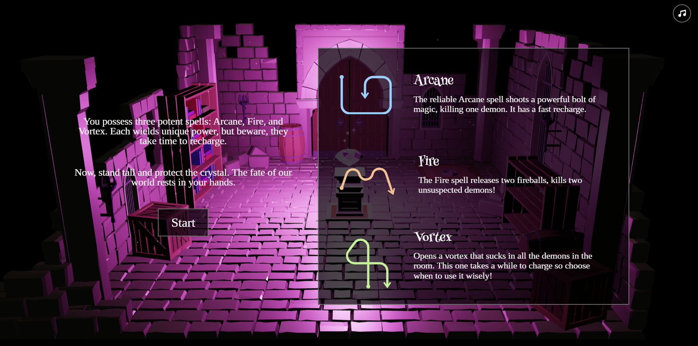
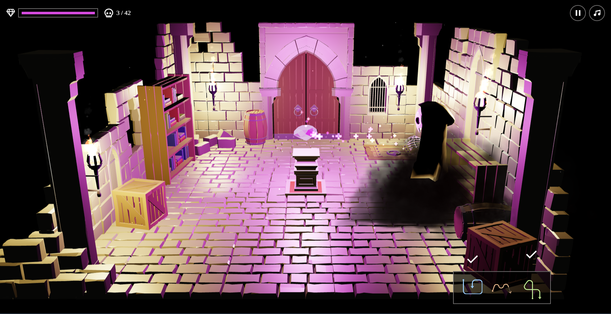

# Spell Caster Game

A mystical 3D game where you defend a crystal from an onslaught of demons by drawing magical spells.

[](https://[your-github-username].github.io/[your-repository-name]/)
## 🔮 Description

"Spell Caster" is an immersive web-based game where players take on the role of a Guardian tasked with protecting a powerful crystal from encroaching demons. Utilize a variety of spells, drawn by hand gestures, to vanquish your foes and survive the waves of enemies.
<!-- Add your images here -->





---

## ✨ Features

* **Dynamic Spell Casting:** Draw unique shapes to cast Arcane, Fire, and Vortex spells.
* **Immersive 3D Environment:** Engage in battles within a beautifully rendered 3D arena powered by Three.js.
* **Resource Management:** Strategically use spells, considering their recharge times.
* **Progressive Difficulty:** Face increasing numbers of demons in the campaign mode, or test your endurance in endless mode.
* **Responsive UI:** A user interface that adapts to various screen sizes.

## 🚀 Technologies Used

### Built With


## 🎮 Setup & Installation

To set up and run this game locally, follow these steps:

1.  **Clone or Download:**
    Download or clone this repository to your local machine.

    ```bash
    git clone [repository-url-here]
    cd spell-caster-game
    ```

2.  **SCSS Compilation (Important!):**
    The project uses SCSS for styling. Browsers cannot directly interpret SCSS. You need to compile `style.scss` into `style.css`.

    **Option A: Using Node.js `sass` package (Recommended)**
    * Ensure you have Node.js and npm (or yarn) installed.
    * Install the `sass` compiler globally:
        ```bash
        npm install -g sass
        # or
        yarn global add sass
        ```
    * Navigate to your project directory in the terminal and compile the SCSS:
        ```bash
        sass style.scss style.css
        ```
    * For live compilation during development (recommended), use:
        ```bash
        sass --watch style.scss style.css
        ```

    **Option B: Using an IDE Extension**
    * Many IDEs (like VS Code) have extensions (e.g., "Live Sass Compiler") that can automate this process. Install one and configure it to compile `style.scss` to `style.css`.

## ▶️ How to Run


1.  Open the `index.html` file in your web browser. You can usually do this by double-clicking it.
    * **Note:** For some features (especially if you were to later implement local asset loading or other advanced JavaScript features), it's best to serve the files using a local web server (e.g., `Live Server` extension in VS Code, or Python's `http.server`: `python -m http.server`).
2. Run directly from this URL: [SpellCaster](https://raw.githack.com/dannz510/Spell_Caster/refs/heads/main/Spell%20Caster/index.html)

---

## 🕹️ How to Play

1.  **Start the Game:** Click "Start" on the title screen.
2.  **Instructions:** Follow the on-screen instructions to learn about protecting the crystal, facing demons, and casting spells.
3.  **Cast Spells:** Draw the indicated spell shapes on the screen using your mouse or touch input to defeat demons.
4.  **Objective:** Protect the crystal from demons!

## 📜 Credits

* **Game Code:** Dannz ([GitHub: @dannz510](https://github.com/dannz510))
* **Room Model:** [Modular Ruins Pack](https://quaternius.com/packs/ultimatemodularruins.html) by [Quaternius](https://quaternius.com/)
* **Skeletal Hand:** by [Jeremy Swan](https://poly.pizza/u/Jeremy%20Swan) ([Poly Pizza Link](https://poly.pizza/m/3b3VmmxXZ7S))
* **Demon:** An edited version of [Skeleton Boy](https://poly.pizza/m/Q0ZWVssZCg) by [Polygonal Mind](https://poly.pizza/u/Polygonal%20Mind)
* **Sound:** From [Zapsplat.com](https://zapsplat.com)

## 📄 License

This project is open-source and available under the [MIT License](https://opensource.org/licenses/MIT). You are free to use, modify, and distribute it for personal and commercial purposes, provided you include the original copyright and license notice.
